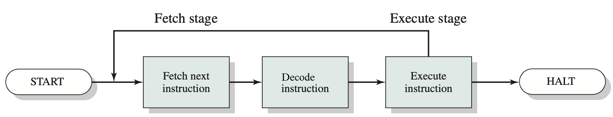

# Introducción a los sistemas informáticos (páginas 9 a 51)

## 1.1 Elementos básicos (página 10)

- **Procesador:** controla la operación del computador y lleva a cabo las funciones del procesamiento de datos.

- **Memoria principal:** almacena los datos y los programas (instrucciones).

- **Módulos de E/S:** transportan los datos entre el computador y su entorno exterior (dispositivos de memoria secundaria, equipos de comunicación y terminales).

- **Interconexión de sistemas (Bus):** ciertos mecanismos y estructuras que permiten la comunicación entre procesadores, memoria principal y los módulos de E/S.

## 1.2 Registros del procesador (páginas 10 a 13)

- **Registros visibles al usuario:** De propósito general. Permite al programador de lenguaje de máquina o ensamblador minimizar las referencias a la memoria principal, optimizado el uso de estos registros. Modificables generalmente por programa usuario. Ej. EAX en x86_64.

- **Registros de control y de estado:** Permiten controlar las operaciones del procesador. son utilizados por el procesador para el control de las operaciones y rutinas privilegiadas del del sistema operativo para controlar la ejecución de los programas. No modificables generalmente por programa usuario. Ej. MAR, MBR, I/OAR.

### Registros visibles al usuario (páginas 11 a 12)

- **Registros de datos:** pueden ser asignados por el programador a diversas funciones (de uso general).

- **Registros de dirección:** Contienen direcciones de la memoria principal de datos e instrucciones o contener una parte de la dirección, que se utiliza en el cálculo de la dirección completa o efectiva.

### Registros de control y de estado (páginas 12 y 13)

#### Registros

- **Contador de programa (PC, Program Counter):** contiene la dirección de la instrucción a se leída.

- **Registro de instrucción (IR, Instruction Register):** contiene la última instrucción leída.

- **Palabra de estado del programa (PSW, Program Status Word):** contiene información de estado como códigos de condición, si las interrupciones están habilitadas o no, tipo de ejecución (privilegiada o no).

#### Códigos de condición (flags)

Conjunto de bits activados poe el hardware del procesador como resultado de determinados operaciones.

En general, las instrucciones de máquina permiten leer estos bits mediante referencias implícitas, pero no pueden ser alterados por referencias explícitas.

## 1.3 Ejecución de instrucciones (páginas 13 a 17)

(fetch instruction) -> (decode instruction) -> (excecute instruction) -> (halt or repeat this sequence with the next instruction)

En su forma más simple el procesamiento de las instrucciones consta de tres pasos: _fetch_, _decode_ y _execute_.

El primero hace referencia a leer la instrucción de memoria.

El segundo a interpretar la instrucción a ser ejecutada

El tercero a ejecutarla.

**Importante:** Las instrucciones se ejecutan de a una a la vez y no pueden ser interrumpidas mientras se están ejecutando

## 1.4 Interrupciones (página 17 a 27)

Una **interrupción** es un mecanismo mediante el cual los módulos de E/S o la cpu pueden interrumpir el flujo normal de ejecución del procesador.

EL HARDWARE DETECTA LAS INTERRUPCIONES, EL SISTEMA OPERATIVO LAS RESUELVE.

CONTEXTO: Valores de los registros de la CPU en el momento que se realiza la interrupci\'on.

IMPORTANTE: Existe una jerarquía/prioridades entre las interrupciones.

### Clases de interrupciones (página 17)

#### Interrupciones por fallo del hardware

Generadas por fallos tales como un corte de energía o un error de paridad de la memoria.

#### Interrupciones de programa o software

Generadas por alguna condición que se produce como resultado de la ejecución de una instrucción, como el desbordamiento aritmético, la división por cero, una referencia a una zona de memoria fuera del espacio permitido al usuario, etc.

#### Interrupciones de reloj

Generadas por un reloj interno del procesador. Símil cronjob pero a nivel hardware.

#### Interrupciones de E/S

Generadas por un controlador de E/S, para indicar que una operación ha terminado normalmente o para indicar diversas condiciones de error.

#### Interrupciones enmascarables

Pueden ser ignoradas/postergadas. No son críticas.

#### Interrupciones no enmascarables

No pueden ser ignoradas. Son críticas.

#### Interrupciones de hardware

Provienen de cualquier dispositivo que no es la CPU.

### Tratamiento de las interrupciones (página 20 a 24)

Partiendo del momento en que el proceso termina la ejecución de una instrucción, la siguiente secuencia de eventos tendría lugar:

1. El procesador, luego de finalizada la instrucción que estaba en curso, pregunta si hay interrupciones.

2. De haber, el procesador guarda la información de contexto mínima necesaria para reanudar luego la ejecución (PSW), la ubicación de la próxima instrucción ejecutar (PC), el contenido  en la pila de control del sistema

3. El procesador transfiere el control a la rutina de interrupción. Esto se hace cargando al PC la ubicación de entrada del programa que tratará la interrupción.

4. Se ejecuta la rutina de interrupción, que puede ser a su vez interrumpida por interrupciones de mayor prioridad o no, dependiendo de la implementación.

5. Luego de finalizada la rutina de tratamiento de la interrupción, se recuperan de la pila los valores de los registros del procesador que se habían guardado, el PSW y el PC.

# Bibliografía

STALLINGS William. Sistemas Operativos: principios de diseño e interioridades (Cuarta Edición). PEARSON EDUCACIÓN S.A., Madrid, 2001. ISBN: 84-205-3177-4.
